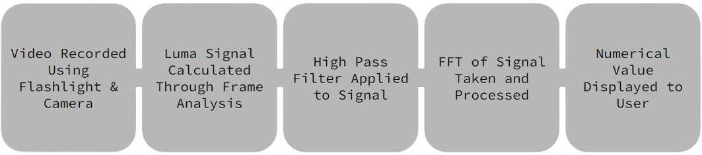
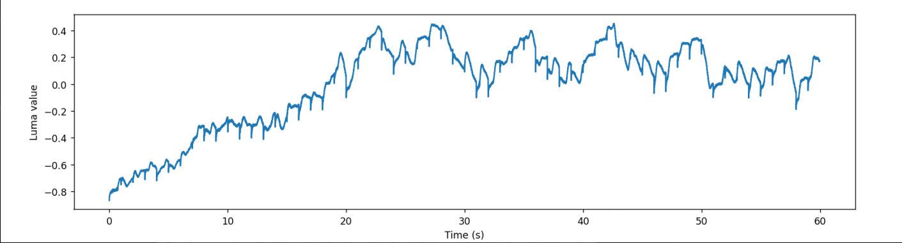
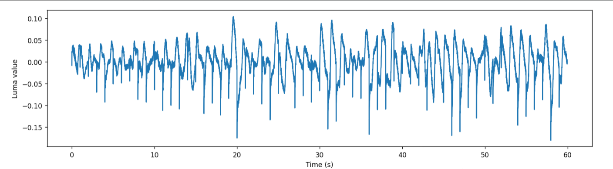

# Healthy Pocket: Passive Heart Rate Monitoring Utilizing Smartphones

## Table of Contents
- [Project Overview](#project-overview)
- [Repository Structure](#repository-structure)
- [Problem Statement](#problem-statement)
- [Design Specifications](#design-specifications)
- [Methods](#methods)
- [Engineering Analysis and Test Data](#engineering-analysis-and-test-data)
- [Conclusions](#conclusions)
- [Future Work](#future-work)
- [Credits](#credits)

## Project Overview
The Healthy Pocket Project aims to transform the way cardiovascular health monitoring is done for individuals working from home. We have designed a smartphone application that utilizes a phone's camera and flashlight to passively record and analyze heart rate data. Our application reduces the need for constant user input and wearable devices, making heart rate monitoring more accessible and less intrusive.

## Repository Structure

|Project Directories | Brief Description|
|--------------------|------------------|
|[`/src`](./src)     | Contains the source code for the project, subdivided into `/android` for the Android application code and `/backend` for the backend server code. |
|[`/images`](./images) | Contains screenshots and images to display on the README.md for the repository. |
|[`/data`](./data)   | Contains data used for testing and development. |
|[`/docs`](./docs)   | Contains documentation about the project, including design documents and user manuals. |
|[`/test`](./test)   | Contains various scripts and tools for building, deploying, and testing the project. |
|`.gitignore`        | A file specifying patterns of files/directories to ignore in git operations. |
|`LICENSE`           | This file contains the license under which the project is released. |
|`README.md`         | This file contains detailed information about the project, its architecture, and its usage. |

## Problem Statement
The COVID-19 pandemic has dramatically increased the number of people working from home. With this change, sedentary behaviors and related health issues such as poor posture and lack of physical activity are on the rise, increasing the risk of heart disease. Current health monitoring devices and applications are not ideal as they require constant user input or are abandoned soon after purchase. Our goal is to provide a passive heart rate monitoring solution that is easy to use and requires minimal user interaction.

## Design Specifications
We are developing a smartphone application that measures, records, and presents heart rate data while the phone is sitting passively in a user's pocket. Our design constraints include:
- Utilizing only the built-in hardware of a smartphone.
- Collecting cardiovascular health metrics passively, requiring no user input.
- Adapting to different pocket fabrics, phone orientations, and user demographics.

## Methods

This project utilized a unique approach to heart rate monitoring by leveraging smartphone technology, namely the flashlight and camera.

   
  <em>Fig.0 - Abstract Pipeline for Heart Rate Detection.</em>

### Video Recording and Luma Signal Extraction
The initial phase of the process involved capturing a 15-second video using the phone's flashlight and camera through various types of pocket fabric such as cotton, denim, and polyester/nylon. Upon completion of the recording, the video was instantly transmitted to a Google Firebase Storage Bucket. The receipt of this video in the storage bucket triggered a Google Cloud Function, which undertook the task of back-end signal processing on the received video sample.

Next, the extraction of luma (brightness) values from the video's Red-Green-Blue (RGB) values was carried out, isolating the red color values which correspond to changes in blood volume. The calculated luma values were then converted into a numerical series that represented a raw signal of blood volume changes.

   
  <em>Fig.1 - Raw luma values captured from a video recording in blue denim pockets.</em>

### High Pass Filtering and FFT Processing

The extracted raw signal was further refined for analysis by applying a high-pass filter, which removed any upward-trending data and recentered the signal around zero.

   
  <em>Fig.2 - Processed signal of luma values using a high pass filter.</em>

Following the high-pass filtering, a Fast Fourier Transform (FFT) was applied to the filtered signal. The FFT process identified the peak frequency within the human heart rate range, providing an estimate of the heart rate for the duration of the video recording.

   
  <em>Fig.3 - Processed signal of luma values of blue denim jeans pocket (top) and Fast Fourier Transform of heart rates of blue denim jeans pocket (bottom).</em>

Finally, the estimated heart rate was compared to the average value reported by a pulse oximeter to verify the accuracy of the estimation.

### Flutter Front-End Application
The end user interacts with the system through a front-end application developed using Flutter. Currently, the application is only compatible with Android devices. It provides the user with an average HR display and the most recent HR measurements. An additional "video" tab facilitates manual recording for immediate heart rate readings as opposed to regular passive recordings. Furthermore, a "profile" tab is available to display and update the user’s personal information.

<table>
  <tr>
    <td align="center"> Fig.4 - Home screen of the application with an interactive chart.</td>
    <td align="center"> Fig.5 - Recording screen and pop-up heart rate result after processing.</td>
    <td align="center"> Fig.6 - Profile screen where user can alter their personal information.</td>
  </tr>
</table>

## Engineering Analysis and Test Data
We tested our application against a commercial pulse oximeter with over 280 trials across 20 participants, considering different trouser fabrics (cotton, denim, polyester). Our initial trials showed high average errors in heart rate measurement (>20 BPM). However, the error was significantly reduced in subsequent trials (<6 BPM). This promising result indicates potential, although it should be noted that further improvements are needed for consistent accuracy.

## Conclusions
Our project has demonstrated potential in passive heart rate monitoring using smartphone technology. However, we acknowledge that the current version of the application has limitations. High deviation from actual heart rate measurements in some conditions and the discrepancy in results obtained from different test phases underline the need for more rigorous testing and improvements in signal processing.

## Future Work
In future iterations, we aim to improve our signal processing algorithms for higher accuracy, incorporate multiple peak predictions in the FFT analysis, and develop metrics for heart rate variability and stress levels. Additionally, we plan to extend the application to iOS devices and enable passive heart rate detection and recording while reducing battery usage.

## Credits
This project was made possible thanks to the hard work and dedication of our team members:

- **Amit Peled (amitp.9787@gmail.com)**: Lead Developer; Defined algorithms to process and extract biometric signal data from video recordings; Developed a front-end application to capture and display processed user biometric information. 
- **Andrew Weakley (asw916@uw.edu)**: Data and Deliverables Lead; Led mass data collection and efforts to supply deliverables.
- **Chad Orite (yorite@uw.edu)**: Versatile Gap Filler; Assisted with any lacking areas of the project.
- **Matthew Van Ginneken (mattcvan@uw.edu)**: Data and Image Analysis Lead; Defined algorithms to verify the accuracy and functionality of application results. Additionally produced figures for data analysis.
- **Talha Agcayazi (talha.robotics@gmail.com)**: Project Mentor; Developed and maintained project pipeline.

We would also like to thank the University of Washington Department of Bioengineering for their support.

